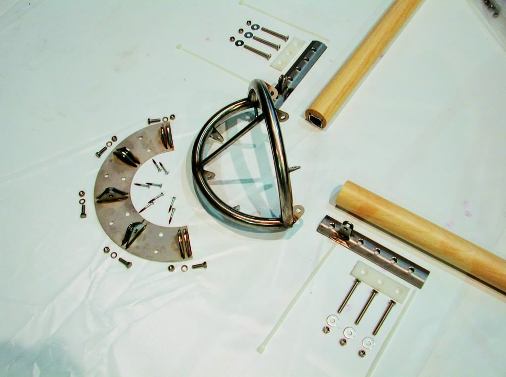
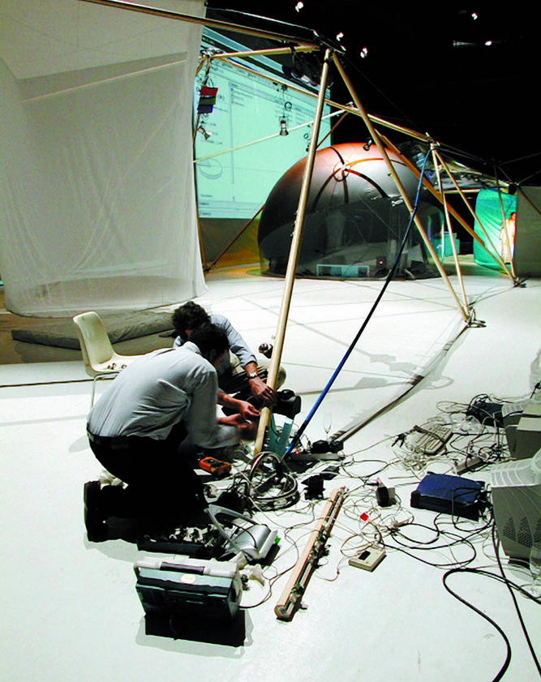
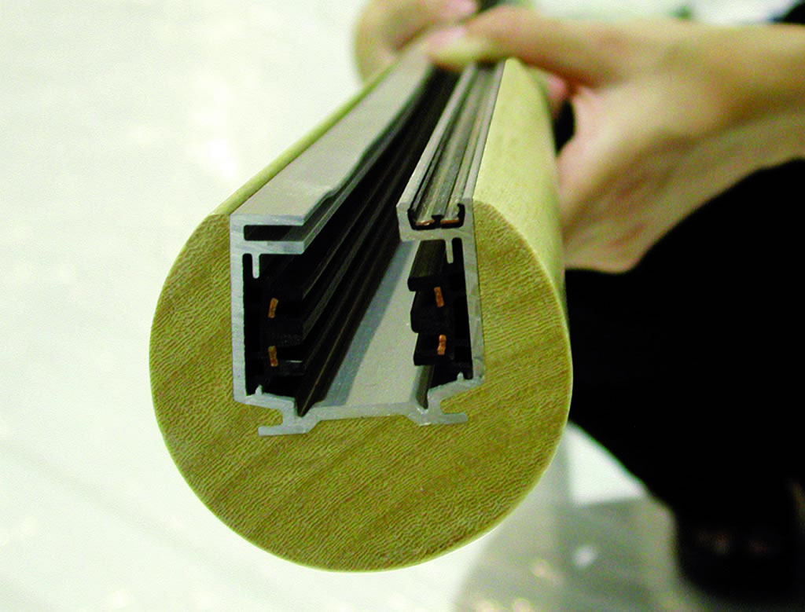

+++
author = "Hugo Authors"
title = "Media House"
date = "2000-06-09"
description = "With Metápolis, MIT, Elisava and i2CAT."
categories = [
    "Networks",
    "Domotics"
]
tags = [
    "telepresence",
    "microcontroller"
]
image = "media_house.jpg"
+++

## "The house is the computer, the structure is the network." <!--more-->

The Media House Project is the fruit of a strategic alliance between the **Massachusetts Institute of Technology’s Media Lab’s Consortium** (Things that think), the **Metápolis** group from Barcelona and the **Fundaciò Politècnica de Catalunya**, with the collaboration of the consortium **I2CAT** and the **Elisava Design School**. The purpose is to unite their respective potential in order to build a prototype of an informational house.

This Project enables the testing of the progression of information Technologies beyond that of computers and integrates them into everyday life, literally looking to build computers from the components of buildings, in such a way, that the logical intelligence of a structure can grow with its physical form.

The Metapolis Architects have developed an informative structure, which incorporates in just one element the physical structure, the electrical network, and the data network, which enables a dynamic and configurable link between the entities (people, objects, space, limits, networks and contents) and that which create an inhabitable environment.

## Images

  




