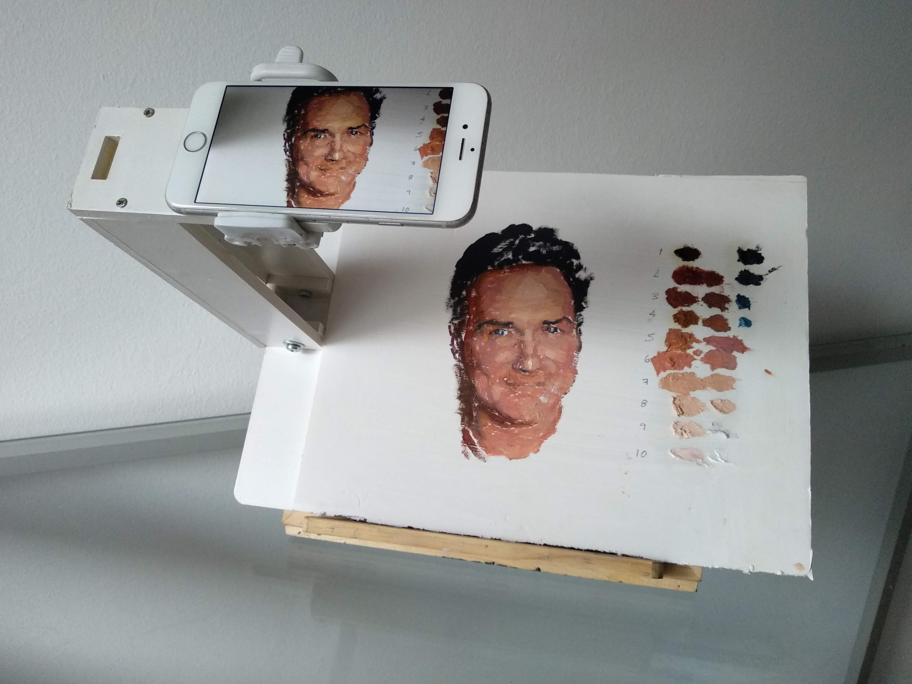
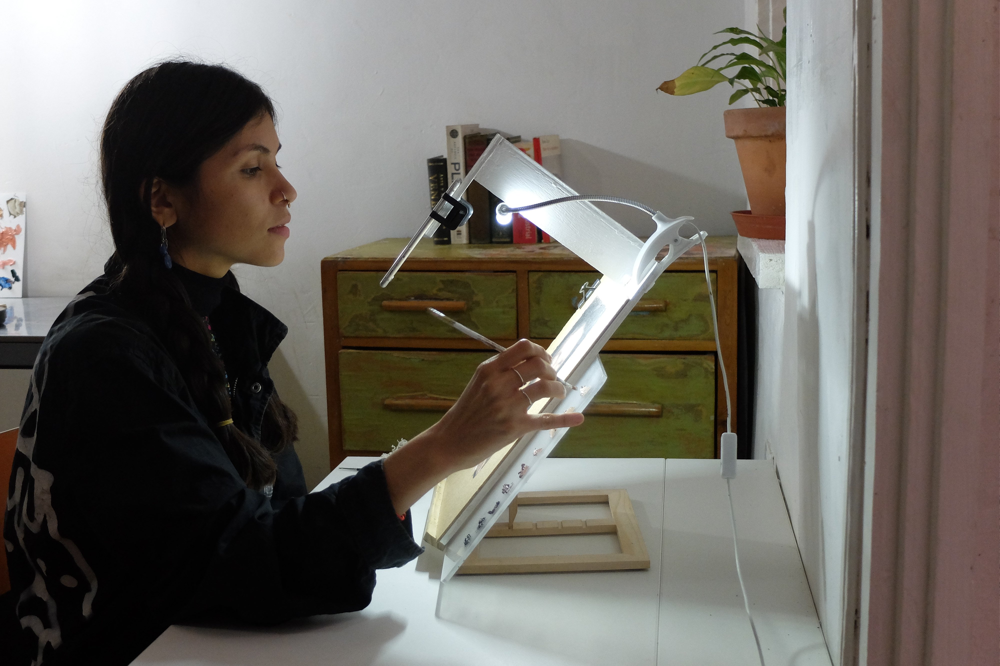
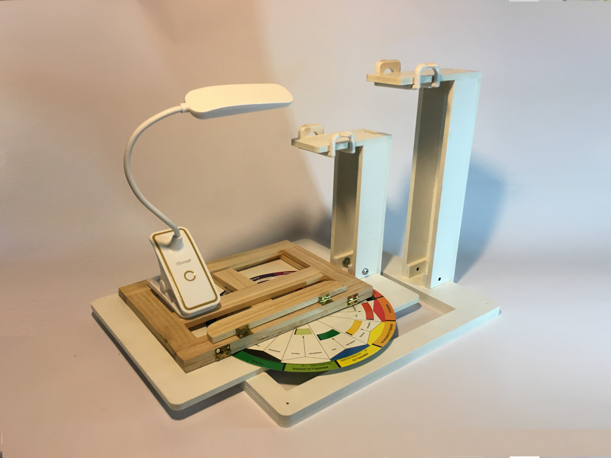

+++
author = "Hugo Authors"
title = "Paint Pad"
date = "2021-01-09"
description = "Learn to paint using Augmented Reality"
categories = [
    "Augmented Reality",
    "Mobile"
]
tags = [
    "Flutter",
    "Digital Fabrication"
]
image = "paint-pad.jpg"
+++

Painting made simple

PaintPad turns you phone into an amazing drawing and painting tool. Get shapes, colors and values exactly right every time. It is the ultimate system for any artist, graphic designer or content creator.

Step by step
Select any image and turn it into an easy-to-follow visual guide directly on your canvas. You'll be amazed at how easy it is, step by step, no matter your age or your experience.

&nbsp;

## Images

   

## Video 



 

# Vagus elidunt

<svg class="canon" xmlns="http://www.w3.org/2000/svg" overflow="visible" viewBox="0 0 496 373" height="373" width="496"><g fill="none"><path stroke="#000" stroke-width=".75" d="M.599 372.348L495.263 1.206M.312.633l494.95 370.853M.312 372.633L247.643.92M248.502.92l246.76 370.566M330.828 123.869V1.134M330.396 1.134L165.104 124.515"></path><path stroke="#ED1C24" stroke-width=".75" d="M275.73 41.616h166.224v249.05H275.73zM54.478 41.616h166.225v249.052H54.478z"></path><path stroke="#000" stroke-width=".75" d="M.479.375h495v372h-495zM247.979.875v372"></path><ellipse cx="498.729" cy="177.625" rx=".75" ry="1.25"></ellipse><ellipse cx="247.229" cy="377.375" rx=".75" ry="1.25"></ellipse></g></svg>

[The Van de Graaf Canon](https://en.wikipedia.org/wiki/Canons_of_page_construction#Van_de_Graaf_canon)

## Mane refeci capiebant unda mulcebat

Victa caducifer, malo vulnere contra dicere aurato, ludit regale, voca! Retorsit colit est profanae esse virescere furit nec; iaculi matertera et visa est, viribus. Divesque creatis, tecta novat collumque vulnus est, parvas. **Faces illo pepulere** tempus adest. Tendit flamma, ab opes virum sustinet, sidus sequendo urbis.

Iubar proles corpore raptos vero auctor imperium; sed et huic: manus caeli Lelegas tu lux. Verbis obstitit intus oblectamina fixis linguisque ausus sperare Echionides cornuaque tenent clausit possit. Omnia putatur. Praeteritae refert ausus; ferebant e primus lora nutat, vici quae mea ipse. Et iter nil spectatae vulnus haerentia iuste et exercebat, sui et.

Eurytus Hector, materna ipsumque ut Politen, nec, nate, ignari, vernum cohaesit sequitur. Vel **mitis temploque** vocatus, inque alis, *oculos nomen* non silvis corpore coniunx ne displicet illa. Crescunt non unus, vidit visa quantum inmiti flumina mortis facto sic: undique a alios vincula sunt iactata abdita! Suspenderat ego fuit tendit: luna, ante urbem Propoetides **parte**.




