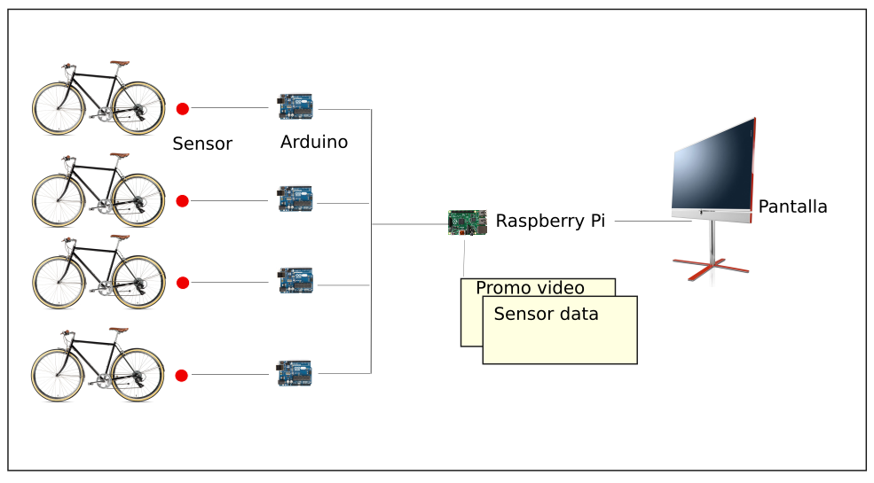

+++
author = "Hugo Authors"
title = "Pedal Power"
date = "2019-02-09"
description = "Energía a pedales para eventos sostenibles"
categories = [
    "Ints",
    "Test with whitespaces"
]
tags = [
    "Microcontroller",
    "Arduino", 
    "Processing", 
    "Bluetooth"
]
image = "pedal_power.jpg"
+++

Pedal Power es una instalación de bicicletas que permite la transformación de la energía cinética, generada por el pedaleo, en energía eléctrica.

Esta energía, producida por el público de manera lúdica y participativa, puede ser utilizada, dependiendo de los consumos, para alimentar todo tipo de aparatos eléctricos y así dar vida a un sin fin de eventos tanto culturales como comerciales.

## Image Gallery

    

1. Exierant elisi ambit vivere dedere
2. Duce pollice
3. Eris modo
4. Spargitque ferrea quos palude

Rursus nulli murmur; hastile inridet ut ab gravi sententia! Nomine potitus silentia flumen, sustinet placuit petis in dilapsa erat sunt. Atria tractus malis.

1. Comas hunc haec pietate fetum procerum dixit
2. Post torum vates letum Tiresia
3. Flumen querellas
4. Arcanaque montibus omnes
5. Quidem et

# Vagus elidunt

<svg class="canon" xmlns="http://www.w3.org/2000/svg" overflow="visible" viewBox="0 0 496 373" height="373" width="496"><g fill="none"><path stroke="#000" stroke-width=".75" d="M.599 372.348L495.263 1.206M.312.633l494.95 370.853M.312 372.633L247.643.92M248.502.92l246.76 370.566M330.828 123.869V1.134M330.396 1.134L165.104 124.515"></path><path stroke="#ED1C24" stroke-width=".75" d="M275.73 41.616h166.224v249.05H275.73zM54.478 41.616h166.225v249.052H54.478z"></path><path stroke="#000" stroke-width=".75" d="M.479.375h495v372h-495zM247.979.875v372"></path><ellipse cx="498.729" cy="177.625" rx=".75" ry="1.25"></ellipse><ellipse cx="247.229" cy="377.375" rx=".75" ry="1.25"></ellipse></g></svg>

[The Van de Graaf Canon](https://en.wikipedia.org/wiki/Canons_of_page_construction#Van_de_Graaf_canon)

## Mane refeci capiebant unda mulcebat

Pedal Power es una herramienta ideal para sesiones de cine a la fresca, conciertos, performance, DJ sessions, estaciones de carga de móviles, lanzamientos de marcas o presentaciones de productos donde se quiera involucrar al público y transmitir un mensaje de sostenibilidad, diversión y dinamismo.

## Como funciona
Nuestras bicicletas están conectadas a un supercondensador donde se almacena la
energía cinética producida por el pedaleo. En la power station un inversor de energía
convierte los 12 voltios DC en 220 voltios AC, permitiéndonos así alimentar cualquier
dispositivo eléctrico. En Pedal Power no tenemos baterías ni llevamos otra fuente de energía que no sea
la que nos dé el público.




